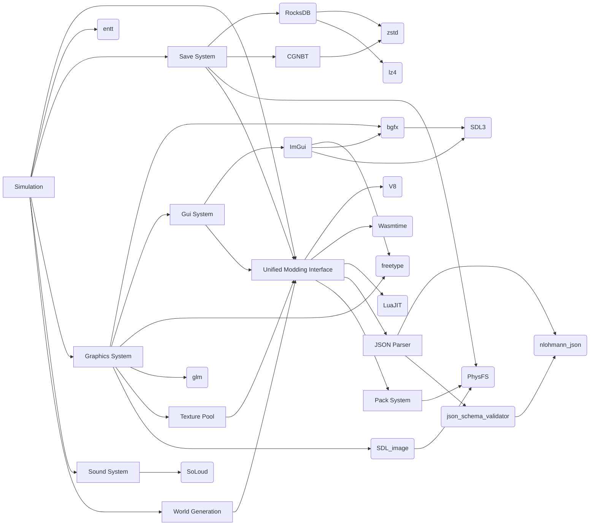

# Designing CherryGrove

This folder contains various documentations or formal drafts for designing CherryGrove.

Argubly the most important folder in the whole website.

## What Should We Design?

CherryGrove is a game framework designed to be extensible and customizable. It took inspiration from Minecraft and various modding API of it, and aims to be a more powerful platform for the future.

To get to this goal, we need to first understand Minecraft's design. The core of Minecraft is the simulation system ("ticking system") that's a Mealy state machine. The main external input is player input, the internal input is the current world state, and the processor calls various functions to process states belong to themselves. The output is the new world state. In CherryGrove, these functions are fundamentally external in the form of content packs. We also need to output the state in a way that can be processed by human beings like showing in the screen and playing in the speakers.

So there is mainly three parts of the design: The core, the interface for content packs, and the interface for human interaction. Surprisingly the easiest part is the core, just like every complex system like an operating system.

## The Core

The core is essentially a `while(true)` loop and we follows basically every game's design: Read input, update state, render output. The most important thing to talk about is optimization. More on that in the [simulation](design/simulation.mdx) document.

## Content Packs

What makes CherryGrove different from other games is that it's more like a tool/engine than a game. Everything is added though content packs, vanilla features are equal to any other features created by you.

TODO:

## The Scary Final Design Graph

