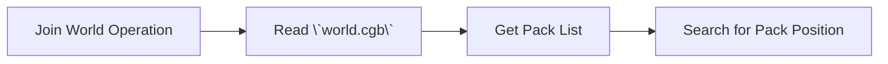

# Getting Started

## Execution Flow

CherryGrove uses two paradigms in pack system: direct-call, and event-driven. Direct-call is for things that will happen deterministically, like loading pack, generating terrain and periodic events. Event-driven is for things that may happen but are not guaranteed, like player actions, block events, and network events.

Every pack will has the following lifecycle:

1. When a world is opened, CherryGrove will read `world.cgb` to get the list of packs used in the world, then build a dependency graph. Then, each pack's `onFirstLoad()` function will be called once.
    - Pack should finish initialization in this function. This is expected to be a big operation.
    - Not all packs in the world will be firstloaded in this phase. CherryGrove will try to load as few packs as possible that can satisfy player's vicinity. Please set `config.alwaysLoad` to `true` if you want a pack to always be loaded.
2. When a player joins the world, each loaded pack's `onPlayerJoin(player)` function will be called once for that player.
3. When a player finished join operation, each loaded pack's `onPlayerReady(player)` function will be called once for that player.
4. When a player leaves the world, each loaded pack's `onPlayerLeave(player)` function will be called once for that player.


```mermaid
graph LR
    -->E[Load Pack Manifest]
    E-->F[Check Dependencies & Incompatibilities]
    F-->G[Build Dependency Graph]
    G-->H[Load Packs]
```