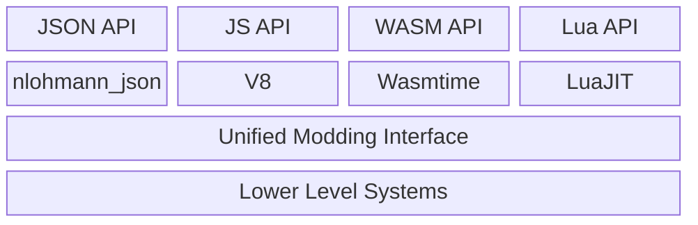

---
title: Overview
---

# Content Pack

Content packs are "mods" for CherryGrove. It's not officially called "mods"("modifications") because there is basically nothing left to modify. For more information check out [Genesis](/cg/design/genesis#customizable).

Content packs can be declarative or scripting-based, or both. It uses JSON for declarative work, and the following programming languages/scripting interfaces are supported:

- JavaScript, via [V8](https://v8.dev), Google's JavaScript engine for Chromium.
- WebAssembly, via [Wasmtime](https://wasmtime.dev), which can be compiled from many languages like C, C++, and Rust. It's the preferred and most efficient way to create a serious pack.
- Lua, via [LuaJIT](https://luajit.org). Lua is widely embedded in games to provide interfaces for modding.

In order to support different modding languages, CherryGrove implemented a layer of interface called Unified Modding Interface (UMI), which provides all possible functions and objects. JSON, JS, WASM and Lua are treated as four respective frontends with different capabilities.

In theory someone can implement a new frontend for UMI fairly easily.

