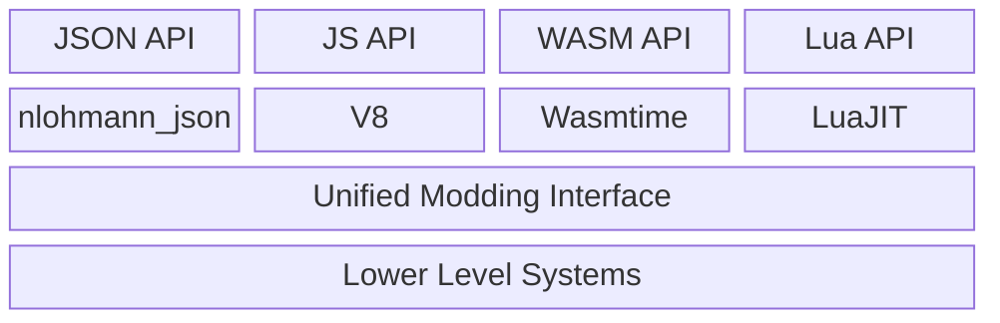

---
title: Overview
---

# Content Pack

## Introduction

### Four Languages for Content Packs

Content packs are "mods" for CherryGrove. It's not officially called "mods"("modifications") because there is basically nothing left to modify. For the reason behind, check out [Genesis](/cg/design/genesis#customizable).

Remember that CherryGrove is a game **framework(or engine)** instead of a game. Content packs are the way to create a game with CherryGrove. Content packs are naturally required to be very powerful and flexible to achieve this goal. However, because we want the learning curve to be as gentle as possible and enable more people to design or modify the game, we designed a system that can support multiple languages and thus multiple levels of complexity, as well as development difficulty. To be precise, the system supports: JSON, JavaScript, WebAssembly, and Lua.

The four languages are not fully compatible with each other except JSON. One content pack can only have JavaScript, WebAssembly, or Lua scripts, but can still have JSON files on top of that. That's because we need a virtual machine to run programming languages but only a parser to interpret a declarative one.

CherryGrove uses almost-the-best engines for these languages, namely:

- JavaScript, via [V8](https://v8.dev).
- WebAssembly, via [Wasmtime](https://wasmtime.dev).
- Lua, via [LuaJIT](https://luajit.org).

In order to support different content pack languages, CherryGrove implemented a layer of abstraction called Unified *Modding* Interface (UMI), which name is mostly for historical reasons and exposes a unified API for all language "frontends". In the JSON API, we call UMI functions in the background. In the other three APIs, we directly expose UMI functions to the scripts via the engines.

### Content Pack Structure

A content pack is basically a folder with a `manifest.json` file in its root directory. The `manifest.json` file describes the metadata, compatibility, and abilities of the content pack.

## Design Principles

It very difficult to design an API system that can support multiple languages with different paradigms and capabilities. For API design, we mainly focus on the following concerns:

1. How does the host know what the pack can do?
2. How does the pack know what the host can provide / will do?
3. How will the host call the pack?
4. How will the pack use the host's information / services?

These questions translate to:

1. How to declare abilities?
2. How to design function names and parameters?
3. Which call paradigm to use?
4. How to design permissions?

Here is how we address these concerns:

1. As opposed to a single entry point, abilities are declared in `manifest.json` file. Each ability has an `entryPoint` that points to a script file, and maybe some other options. The host will load the script file and call the specific functions declared in the ability.
2. As for function names, we try to keep them exactly the same across different APIs, so that developers can easily switch between languages and we don't need to specify languages with function names.
3. We use different call paradigms for different kinds of functions. For lifecycle functions, we call them directly. For most things that may happen, we use the event-driven paradigm. There are also other paradigms for specific use cases like network processor and terrain generator.
4. Special permissions like network access, file system access, etc. are declared in `manifest.json` file. CherryGrove will request user permission before enabling these permissions. General in-game capabilities are always allowed.

## General Structure

Content packs can be recognized in `.zip`, `.7z` files or loose folders.

A content pack must have a `manifest.json` file in its root directory, which describes the metadata of the content pack. For //todo

Other files and folders can be placed in any preferred structure.